# <span style="color: #6eb537;">PagSeguro Android Program</span>

**Formação em Desenvolvimento Android**

**Prof. Paulo Salvatore**

**GlobalCode**

**Tópicos abordados:**

- Estrutura básica da plataforma Android
- Layouts
  - LinearLayout
  - RelativeLayout
  - ConstraintLayout

# Sumário

[TOC]

# Plataforma Android

Para começar a desenvolver na plataforma do Android, precisamos entender alguns requisitos iniciais. É extremamente importante que você se dedique no aprendizado e evolução da sua **lógica de programação**, **programação orientada a objetos**, **java básico** e **XML básico**.

Neste capítulo iremos entender um pouco do universo Android, apresentando os principais termos que precisamos conhecer para conseguir desenvolver nossos aplicativos.

## História

O Android é um sistema operacional baseado em Linux, sendo que seu desenvolvimento iniciou em 2003 através de um startup chamada Android Inc., que posteriormente, em 2005, foi comprada pelo Google antes mesmo de seu lançamento.

O primeiro dispositivo Android foi lançado em 2008 e chegou a marca de 1 bilhão de dispositivos em 2014. Em 2018, o sistema operacional atingiu a marca de 2.7 bilhões de usuários.

## Iniciando o desenvolvimento

Atualmente para desenvolvermos um aplicativo para Android, existem duas linguagens de programação oficiais, `Java` e `Kotlin`, sendo que as aplicações escritas nessas linguagens são convertidas em `bytecodes`, que são códigos binários a serem executados pela Máquina Virtual Dalvik, no smartphone.

A maior parte do sistema operacional Android está disponível em código aberto e é mantido pelo próprio Google, sob algumas licenças, o que traz uma autonomia para os desenvolvedores durante a construção das aplicações, pois é possível entender melhor o que está acontecendo, além de trazer também uma autonomia para os fabricantes de smartphones, pois podem alterar livremente o código fundamental do Android e inserir em seus aparelhos para venda.

A partir da versão 1.5, foram escolhidos nomes de doces em ordem alfabética. Além dos nomes populares, costumamos referenciar as versões com números e também o nível da API, como o `Android Pie - Versão 9.0 - API 28`. Quando estamos desenvolvendo uma aplicação Android, é importante saber o nível das APIs, pois algumas apresentam funcionalidades específicas, e é papel do desenvolvedor certificar de que o dispositivo funciona em todos os smartphones disponíveis no mercado.

Antes de começarmos a desenvolver, é extremamente recomendado conhecer a documentação do Android, uma das documentações de softwares mais completas, lotada de exemplos e boas práticas de desenvolvimento.

Link: https://developer.android.com/

## Ambiente de desenvolvimento

O ambiente de desenvolvimento oficial do Android é o Android Studio, solução apresentada pela parceria entre o Google e a JetBrains, uma empresa russa que possui IDEs de altíssimo nível. O surgimento do Android Studio, em 2014, aposentou a solução anterior, o Eclipse, IDE muito comum para os desenvolvedores de aplicações feita na linguagem de programação Java.

O Android Studio foi baseada na IDE IntelliJ IDEA, recebendo diversas implementações exclusivas para o universo Android, facilitando muito a configuração dos projetos e fornecendo ferramentas essenciais para a construção das aplicações.

Com a IDE é possível realizar todo o fluxo da aplicação, desde a criação do projeto, desenvolvimento e geração do `.apk`, o arquivo compilado da sua aplicação que roda nos smartphones.

Além disso, um outro ponto positivo é que o software roda nas principais plataformas desktop, Windows, Mac e Linux, facilitando a sua utilização por usuários de qualquer ambiente.

## Criando o projeto

Para começar a entender melhor o universo Android, vamos criar nossa primeira aplicação. Nessa aula utilizaremos o Android Studio na versão 3.3.

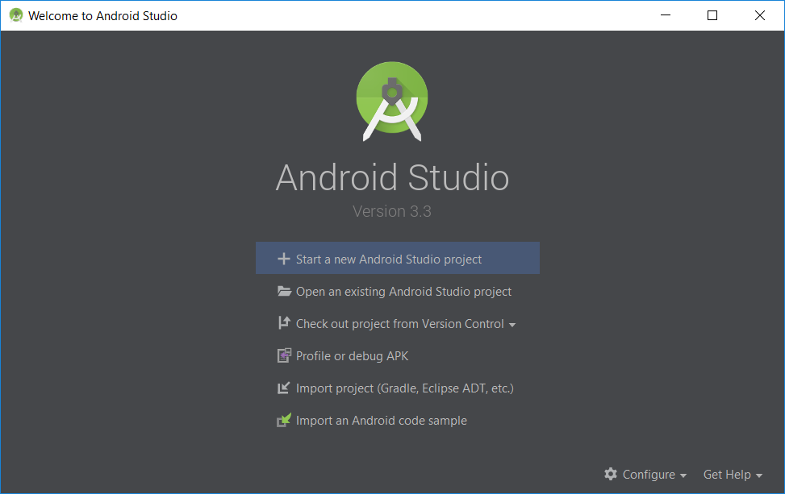

Clique na opção `Start a new Android Studio project`.

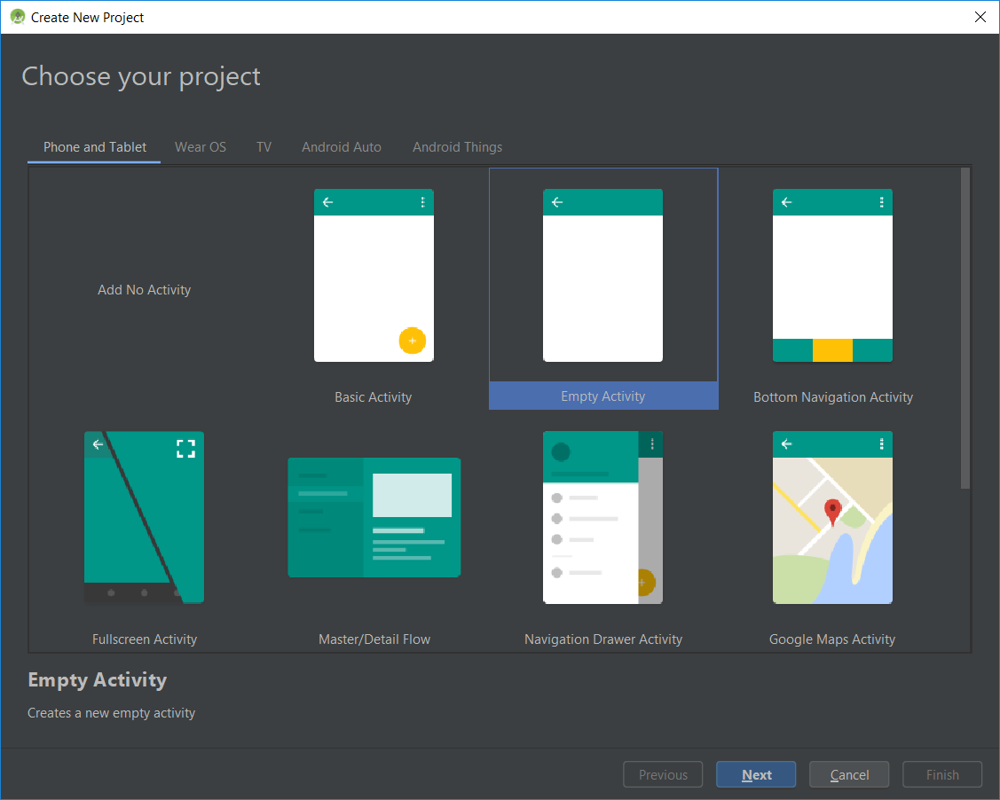

O próximo passo é selecionar o tipo de `Activity` que queremos criar para o nosso projeto. Ela representa uma única tela com uma interface de usuário e é a porta de entrada para as ações do usuário no aplicativo.

Por padrão o Android Studio traz uma série de opções de telas pré-configuradas, fique à vontade para explorá-las no futuro, geralmente facilitam o trabalho inicial dependendo da tela que você deseja criar, entretanto, para iniciarmos o nosso desenvolvimento, selecionaremos a opção `Empty Activity`, que traz a versão mais limpa possível de uma tela pré-configurada.

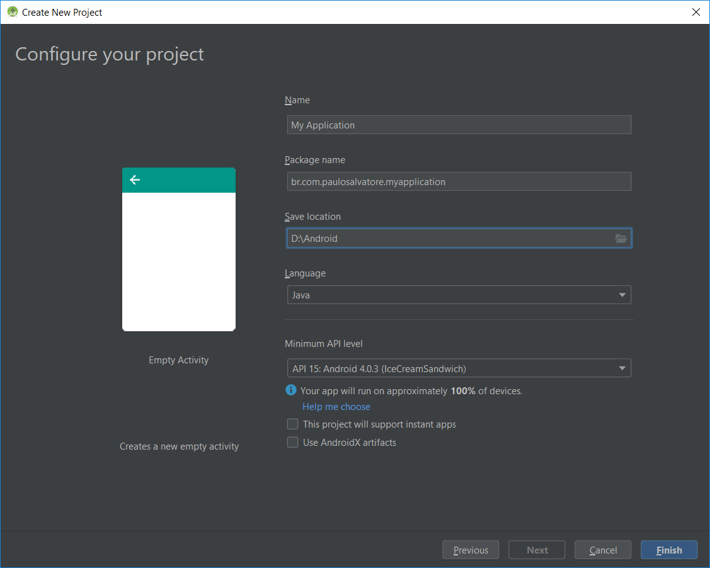

**Name:** Insira o nome do projeto no primeiro campo. Evite nomes com espaços em brancos ou underscore.

**Package name:** Quando inserimos o nome do projeto, automaticamente o campo com o nome do projeto é atualizado. Esse campo serve para identificar nossa aplicação de uma maneira única, e geralmente é composto de uma URL reversa, seguindo do nome da aplicação todo em minúsculo e junto.

**Save location:** Defina um local para o seu app, ele é importante para realizar o backup do projeto futuramente.

**Language:** É possível iniciar um projeto na linguagem Java ou Kotlin. Nesse curso abordaremos ambas as linguagens, mas para nosso projeto inicial, faremos o uso da linguagem Java.

**Minimum API level:** É importante que nosso app tenha compatibilidade com o maior número de dispositivos possíveis, portanto, utilizaremos a API 15 como mínimo. Note que é possível ver outras APIs, seu número de versão e nome popular, como mencionado anteriormente.

**This project will support instant apps:** instant apps são aplicativos que não precisam ser instalados no smartphone para serem executados de forma nativa. Entretanto, para que isso seja possível, há um limite de tamanho fixado pelo Google. Por enquanto não utilizaremos essa opção.

**Use AndroidX artifacts: ** O AndroidX é um unificador de dependências, ou seja, todas as bibliotecas nativas que precisamos para desenvolver uma aplicação comum estarão organizadas dentro do AndroidX. Entenderemos melhor o que ele representa exatamente conforme avançamos no desenvolvimento Android. Deixaremos essa opção **ativada**.

Selecione a opção `Finish` e espere o Android Studio criar o projeto.

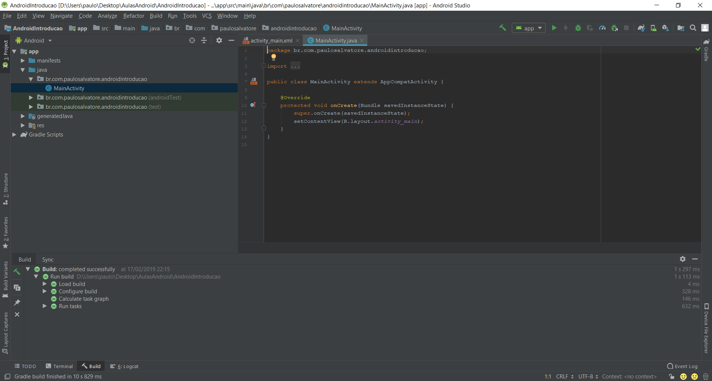

## Activity

Como dito anteriormente, as `Activities` são as classes do Android responsáveis pelas telas das aplicações. Podemos entender um como cada `Activity` sendo uma tela diferente, e uma aplicação possuindo diversas telas. Elas geralmente são compostas de dois itens principais: a `class` e o `layout`. Quando criamos o projeto, pedimos para o Android criar uma `EmptyActivity`, portanto, ele criou uma tela com o conteúdo mínimo necessário para que sua exibição seja necessária, e imediatamente exibiu o conteúdo da `class MainActivity`. Abra o arquivo `activity_main.xml`, na barra superior.

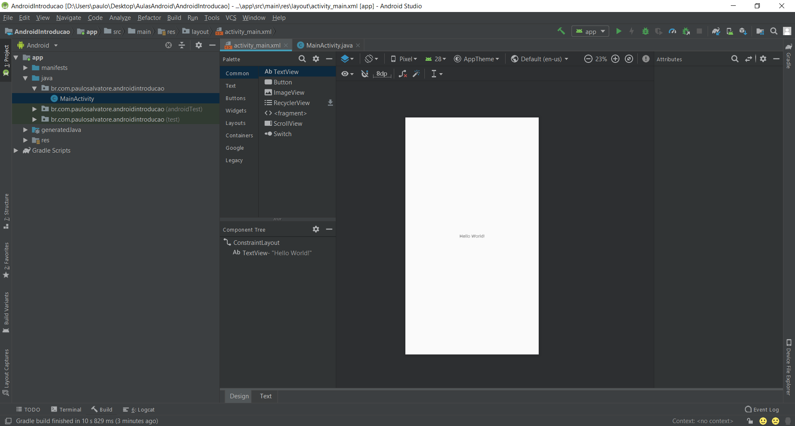

Quando abrimos um arquivo de `layout`, o Android Studio nos mostra um editor gráfico para construção das telas. Podemos arrastar e soltar elementos para construir nossa aplicação.

No canto inferior, note que há duas opções: `Design` e `Text`, sendo que a opção `Design` está selecionada. Clique na opção `Text`.

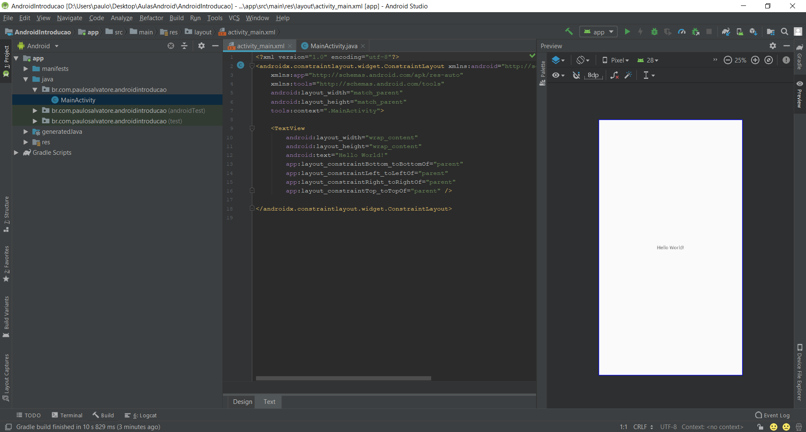

Quando selecionamos essa opção, alternamos para a visualização do código da nossa tela. Tudo que criamos no modo `Design` gera um código em `XML` para que o Android saiba como criá-la. Para ativar/desativar o modo de visualização, clique na opção `Preview`, localizada no canto direito da tela.

## Emulador

Na opção superior do Android Studio, há um botão de `play`. Clique no botão ou acesse pelo atalho `Shift + F10`. Aguarde o `adb ` inicializar, ele é o `Android Debug Bridge`, responsável pela comunicação com um emulador ou dispositivo Android.

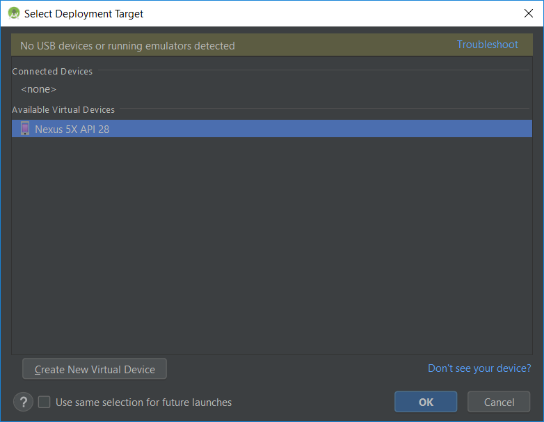

Essa tela irá exibir se há dispositivos conectados disponíveis, para caso queira rodar a sua aplicação direto no seu smartphone, sendo que para isso é necessário ter o modo de desenvolvedor ativado no aparelho. Além disso, ela também irá mostrar emuladores disponíveis. No meu caso, há um emulador da API 28 disponível. Para que você também consiga executar suas aplicações, clique na opção `Create New Virtual Device`.

Selecione algum Hardware da categoria Phone que achar interessante. A diferenciação do Hardware geralmente está relacionada ao tamanho da tela, que será útil para que você consiga projetar seus layouts.

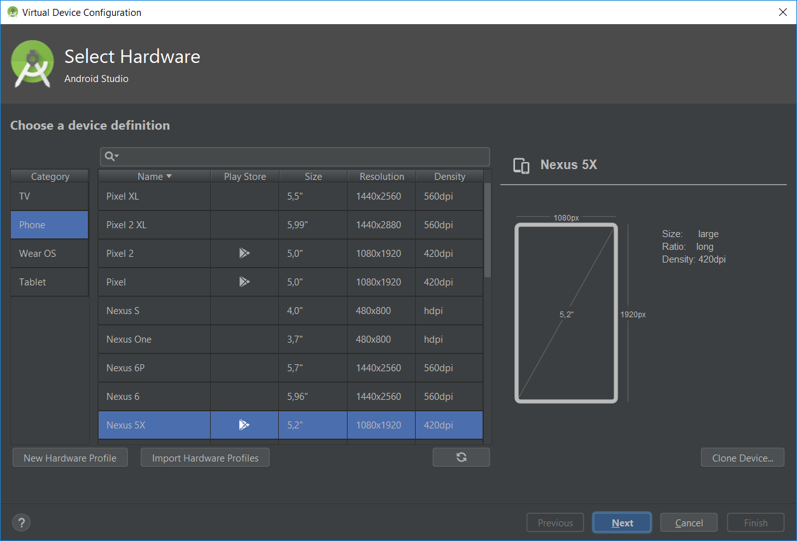

Após selecionar o Hardware, selecione uma imagem do sistema. No meu caso, irei criar um dispositivo com a API 28. Caso você não tenha a API baixada, clique na opção `Download` e aguarde o Android Studio finalizar o processo. Em seguida, clique na opção `Next`.

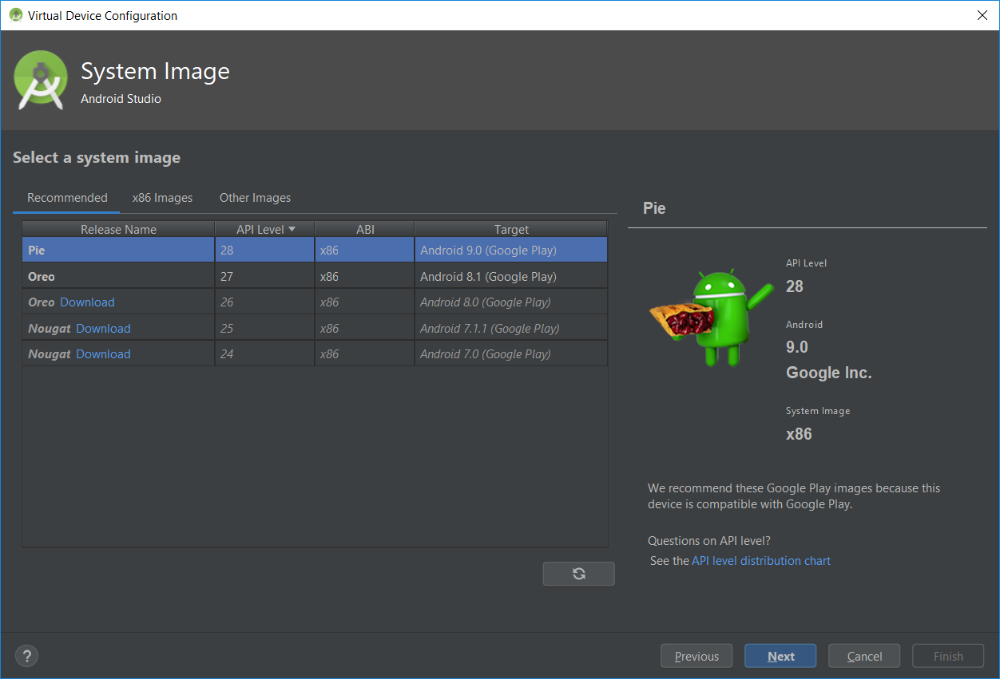

Revise as configurações, altere-as caso ache necessário e clique na opção `Finish`. Isso irá criar um emulador para que você teste suas aplicações sem sair do ambiente de desenvolvimento.

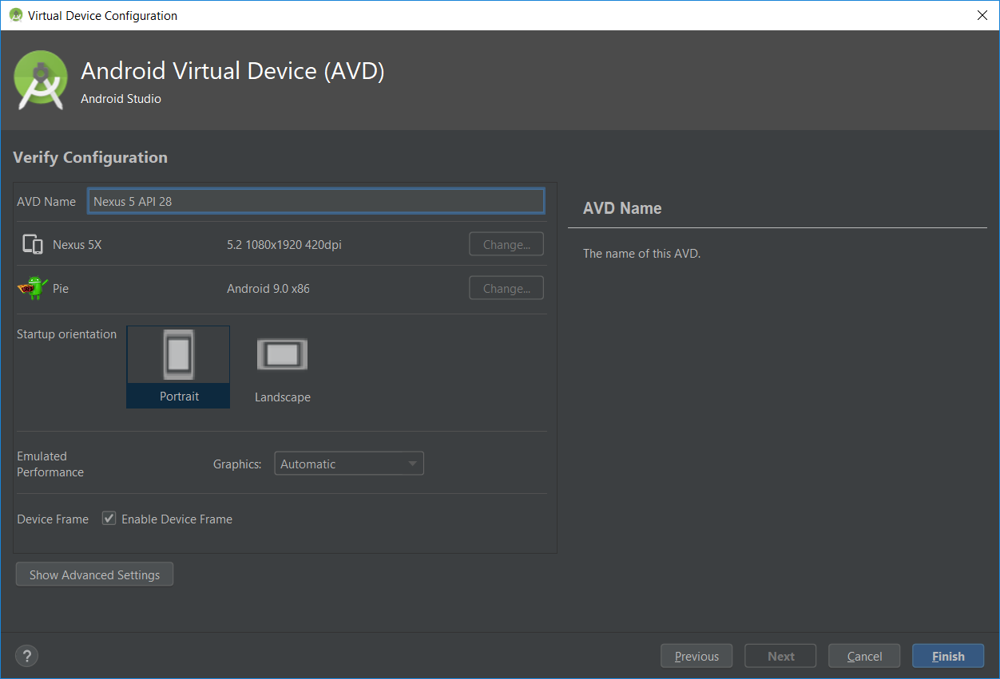

Com o emulador criado, selecione-o na lista do `adb` e clique na opção `OK`. Aguarde sua inicialização, o processo de build do apk e o nosso primeiro aplicativo será executado.


## Estrutura do projeto

Uma parte bem importante do desenvolvimento Android é entender como o nosso projeto está estruturado. Na barra lateral esquerda é possível ter uma visualização de todos os arquivos que compõem o projeto. Na imagem a seguir, temos uma separação dos itens mais importantes que devemos conhecer.


- **manifests:** principal arquivo da aplicação, define todo o conteúdo da aplicação, incluindo nome, ícone, telas, permissões, etc.
- **app:** diretório principal da aplicação.
- **java/br.com.../:** pacote principal da aplicação. Nessa pasta que iremos inserir os arquivos do nosso projeto.
- **res:** recursos importante para a aplicação, desde imagens e ícones, até textos e layouts das telas.
- **drawable:** imagens e ícones.
- **layout:** arquivos das Activities.
- **values:** arquivos de configuração para concentrar cores, textos e estilos do app.
- **Gradle Scripts:** arquivos de configuração do projeto, responsáveis por definir.

## Layout

Como dito anteriormente, o layout é a aparência visual de uma tela, podemos criar as telas utilizando o modo de design, arrastando e soltando elementos, ou programá-lo utilizando XML. Um dos pontos mais importantes do layout é construir/entender sua estrutura de XML, pois em muitos casos é necessário alterá-la para atingir resultados desejados, além do fato de que a única maneira de compartilhar layouts é através do código XML.

### Código XML

Geralmente o layout XML está estruturado com uma tag principal, do próprio layout, que contém todos os elementos de interface e suas devidas configurações. No caso da nossa `MainActivity`, o Android Studio gerou o projeto já com um `ConstraintLayout` e um elemento `TextView` dentro.

```xml
<?xml version="1.0" encoding="utf-8"?>
<androidx.constraintlayout.widget.ConstraintLayout xmlns:android="http://schemas.android.com/apk/res/android"
    xmlns:app="http://schemas.android.com/apk/res-auto"
    xmlns:tools="http://schemas.android.com/tools"
    android:layout_width="match_parent"
    android:layout_height="match_parent"
    tools:context=".MainActivity">

    <TextView
        android:layout_width="wrap_content"
        android:layout_height="wrap_content"
        android:text="Hello World!"
        app:layout_constraintBottom_toBottomOf="parent"
        app:layout_constraintLeft_toLeftOf="parent"
        app:layout_constraintRight_toRightOf="parent"
        app:layout_constraintTop_toTopOf="parent" />

</androidx.constraintlayout.widget.ConstraintLayout>
```

Para explorar mais recursos do Layout, recomendo que dê uma passada rápida na documentação, que contém vários exemplos e mostra muita coisa que é possível fazer com os layouts do Android: https://developer.android.com/guide/topics/ui/declaring-layout.

### Elementos de Estrutura

Precisamos saber os principais elementos de estrutura de layout, que definem como a tela irá se comportar.

- **ConstraintLayout:** Atualmente é o estilo de layout padrão das `Activities` do Android. Permite de forma fácil a criação de layouts complexos e grandes, que se ajustem de forma fácil às telas dos dispositivos. Funciona com a definição de `constraints`, que são pontos de ligação entre um elemento e outro, permitindo com que os elementos se ajustem de forma relativa aos outros.
- **LinearLayout:** Define uma direção para os elementos, podendo ser vertical ou horizontal, e ajusta todos dessa maneira, não precisando configurar cada elemento individualmente (como é o caso do `ConstraintLayout`), pois organiza todos de maneira automática. Indicado para layouts mais simples.

### Elementos de Interface

Além de conhecer os elementos de estrutura, também precisamos também conhecer os principais elementos de interface. Na visão `Design` do editor de layout é possível visualizar todos os disponíveis, sendo que os principais são:

- **TextView:** elemento comum para exibição de texto, semelhante ao `label` do HTML.
- **EditText:** elemento comum para edição de texto, semelhante ao `input text` do HTML.
- **Button:** elemento para interação de cliques com o usuário.
- **ImageView:** elemento para exibição de imagens.
- **CheckBox:** elemento para que o usuário possa selecionar/desselecionar alguma informação única.
- **Switch:** Semelhante ao `CheckBox`, com um visual diferente.
- **RadioGroup/RadioButton:** elemento para que o usuário possa escolhe uma dentre múltiplas opções. Um `RadioGroup` possui diversos `RadioButtons`, sendo que cada `RadioButton` é uma opção diferente.
- **ScrollView:** Útil para telas/pedaços de tela que precisam possuir um comportamento de barra de rolagem, quando possuem muitas informações. Muito útil para fazer a aplicação funcionar com o aparelho tanto na horizontal quanto na vertical, sem precisar de grandes adaptações.

## Manipulando elementos do layout

Manipular os elementos do layout é algo que precisamos realizar praticamente o tempo todo, pois é dessa forma que trabalhamos com a informação e exibimos para o usuário o que ele realmente quer ver.

Para que isso seja possível, precisamos pegar o elemento que queremos manipular e definir um valor de ID para ele.

No arquivo `activity_main.xml`, selecione o modo de `Design`, e selecione o único elemento `TextView` dentro do `ContraintLayout`. Com o elemento selecionado, uma barra na lateral direita irá aparecer, chamada `Attributes`. Procure pelo primeiro campo, chamado `ID`, escreva `tvPrincipal` e pressione `Enter`. Com isso, definimos a ID `tvPrincipal` para o elemento `TextView`.

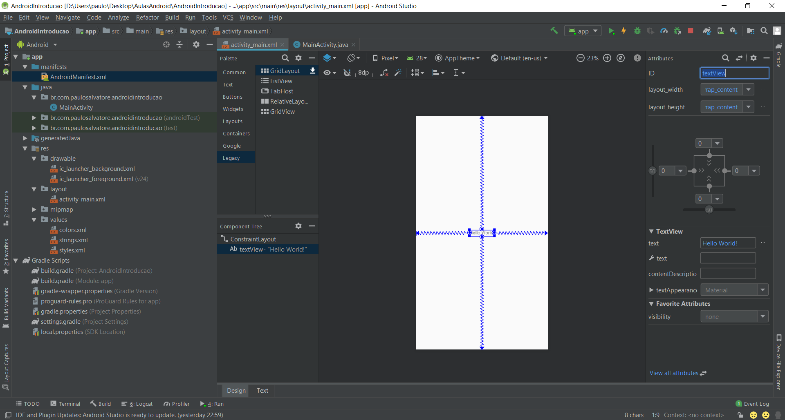

ID definido, é hora de manipular o elemento no arquivo `MainActivity.java`, o arquivo da `class` da nossa `Activity`.

Deve escrever nossa lógica dentro das chaves da declaração `onCreate()`, ele é o primeiro item a ser chamado quando uma tela do Android é criada.

```java
@Override
protected void onCreate(Bundle savedInstanceState) {
  super.onCreate(savedInstanceState);
  setContentView(R.layout.activity_main);
}
```

Para pegar o elemento desejado, precisamos utilizar a declaração `findViewById()`, passando o ID que acabamos de definir. Para acessar o atributo de ID, faremos através da declaração `R.id.ID_DEFINIDO`, que no nosso caso é `R.id.tvPrincipal`. Armazenaremos isso em uma variável do tipo `TextView`, que é o tipo do campo que estamos selecionando.

Escreveremos logo abaixo do linha `setContentView(R.layout.activity_main);`.

```java
@Override
protected void onCreate(Bundle savedInstanceState) {
  super.onCreate(savedInstanceState);
  setContentView(R.layout.activity_main);

  TextView tvPrincipal = findViewById(R.id.tvPrincipal);
}
```

Para alterar o texto do campo, podemos utilizar a declaração `nomeVariavel.setText("Novo Texto")`. Portanto, no nosso caso, faremos isso da seguinte forma:

```java
@Override
protected void onCreate(Bundle savedInstanceState) {
  super.onCreate(savedInstanceState);
  setContentView(R.layout.activity_main);

  TextView tvPrincipal = findViewById(R.id.tvPrincipal);
  tvPrincipal.setText("Novo Texto");
}
```

Rode o projeto e veja o resultado!


Imediatamente quando a tela do aplicativo abre o texto é alterado. Para tornar o comportamento mais interessante, podemos adicionar um evento. Faremos o seguinte: assim que o elemento de texto for clicado, alteramos o seu conteúdo.

Para fazer isso, precisamos adicionar um comportamento chamado`onClickListener`, declarando `tvPrincipal.setOnClickListener()`. Em seguida, dentro dos parênteses, escreveremos `new View.OnClickListener()`. Utilize o recurso de auto completar do Android Studio e ele irá preencher o código completo. Por fim, adicione o conteúdo do `setText` dentro das chaves do `onClick` do `View.onClickListener`. Para que o código funcione, precisaremos inserir a palavra `final`, no começo da declaração do `TextView tvPrincipal`, da seguinte maneira:

```java
@Override
protected void onCreate(Bundle savedInstanceState) {
  super.onCreate(savedInstanceState);
  setContentView(R.layout.activity_main);

  final TextView tvPrincipal = findViewById(R.id.tvPrincipal);

  tvPrincipal.setOnClickListener(new View.OnClickListener() {
    @Override
    public void onClick(View v) {
      tvPrincipal.setText("Novo Texto");
    }
  });
}
```

Rode o programa e teste o resultado! Basta clicar no elemento `tvPrincipal` e ele tem o seu conteúdo alterado.

Ótimo! Agora que sabemos como criar telas, elementos e manipular elementos através de eventos estamos prontos para criar nossa primeira aplicação.